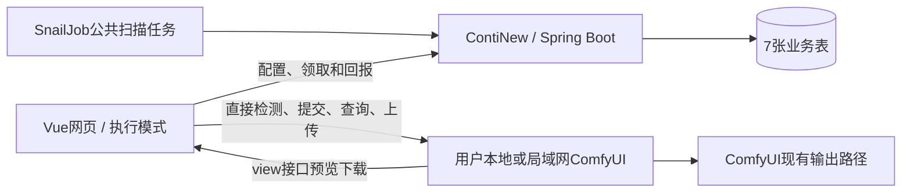

# ComfyUI 项目开发文档

版本：v0.3，ContiNew + SnailJob，7 张业务表  
日期：2026-10-05  
本版取代 v0.1/v0.2 的数据模型。Luna 起草 SQL，主代理复核并同步设计。当前交付文档与 SQL，尚未实施产品或完成实机联调。

## 1. 项目范围

登录用户仅通过 Vue 网页配置自己的多台 ComfyUI、导入工作流、设置常用参数及定时批量任务。云端基于 ContiNew/Spring Boot，复用用户、权限、字典、日志和 SnailJob，不开发本地连接程序。

网页保持打开并启用执行模式后，浏览器直接调用本机或局域网 ComfyUI。文件仍由 ComfyUI 按原输出配置保存，浏览器直接预览、下载，云端只保存任务及文件元数据。

云端按计划时间产生待执行任务，实际提交依赖网页、电脑、ComfyUI 和网络可用。关页、休眠或浏览器挂起会延迟提交；恢复后补执行。已经提交给 ComfyUI 的任务通常继续运行。第一版不承诺关闭网页后自动提交或精确准点生成。

## 2. 架构与框架复用

SnailJob 负责公共扫描任务的周期触发及调度执行日志。业务扫描执行器只调用 ServiceImpl，根据用户计划创建批次和任务，不直接访问用户内网 ComfyUI。

建议公共执行器名称 comfyPlanScan，初期每 10 秒唤醒一次，实际周期由容量和 SnailJob 配置确定。注册执行器后仍需在任务调度中建立、启用触发规则，启动 SnailJob 服务本身不会自动配置这个业务任务。[ContiNew 定时任务说明](https://continew.top/docs/admin/backend/job.html)。

SnailJob 的一次扫描成功，不等于图片生成成功。浏览器提交、重试和生成状态保留在业务表中，不能以框架调度日志替代。

普通用户只操作自己的业务计划页面，不给予管理公共扫描任务或整个 SnailJob 控制台的权限。只注册一个公共扫描 Job，不为每个用户计划创建一套平台任务。

## 3. 七张业务表

| 表 | 职责 |
|---|---|
| comfy_instance | ComfyUI 地址、设备 UUID、网页会话及执行租约 |
| comfy_workflow | 导入 JSON、API prompt、常用参数绑定 |
| comfy_schedule | 用户运行规则、执行快照、下一次时间、补执行游标 |
| comfy_task_batch | 每次计划触发或手动提交的批次，合并触发记录 |
| comfy_task | 批次内独立任务、固定参数及状态 |
| comfy_task_attempt | 每次提交/重试及不确定提交证据 |
| comfy_task_output | 本地输出文件引用和可用性 |

不另建设备、会话、租约、工作流版本、参数绑定版本、素材、规则版本、触发实例、事件和业务审计表。不创建或修改模板基础表及 SnailJob 自身表。

实例和工作流可编辑；保存计划时复制完整执行内容到 execution_snapshot_json。创建批次、任务时继续复制快照，并展开每项实际参数、种子和素材引用。补建旧触发点不能读取后来编辑的工作流当前内容。

计划、批次和任务的快照包含来源 ID、配置 revision、原地址及设备、API prompt、节点绑定和参数。状态、租约和游标可更新，但既有执行快照不覆盖。文件访问由任务的原目标快照定位，不读取实例当前的新地址。

## 4. 页面连接与工作流

### 4.1 浏览器接入前提

云端正式网页使用 HTTPS；本地开发可通过 localhost HTTP 页面验证。ComfyUI 可保留 HTTP，但需配置允许该网页 Origin 的跨域访问，用户在浏览器中授权本地网络访问。HTTPS 网页访问不同地址的兼容性受浏览器版本与策略影响，应首先验证 GET、POST JSON、图片上传和 /view。

不要求额外安装软件，不以关闭浏览器安全策略或实验开关作为正式条件。普通公网 HTTP 网页的本地网络访问可能受安全上下文限制，不能通过增加 CORS 就保证解决。[Chrome 本地网络说明](https://developer.chrome.com/blog/local-network-access)、[安全上下文说明](https://developer.mozilla.org/en-US/docs/Web/Security/Defenses/Secure_Contexts)、[ComfyUI 启动参数](https://docs.comfy.org/development/comfyui-server/startup-flags)。

云端令牌不能发送给 ComfyUI。访问仅限已配置 HTTP/HTTPS 地址和固定接口，不提供任意代理、目录读取或网络扫描。

### 4.2 实例与页面执行权

用户配置地址及设备 UUID。localhost 指浏览器所在电脑，另一电脑的相同地址不是原实例。设备 UUID 是站点存储中的随机标识，不是硬件身份；清理存储或换设备要显式重新绑定。

点击“启用本页执行”后，服务端依据当前可信登录会话授予实例执行租约。instance 中保存页面 UUID、登录令牌摘要、递增 epoch、到期时间和心跳；一个实例只有一个活动执行页。另一标签页可查看，不并发提交。

建议心跳每 10 秒、60 秒无心跳视为离线，可配置。租约转移递增 epoch，不删除重建清零。地址或设备变化递增 config_revision；有未完成或不确定任务时禁止更换目标。存在活动计划时需先暂停并显式更新计划快照，不自动改向新地址。

云端用户数据隔离不等于裸 ComfyUI API 的多租户隔离。第一版面向用户自己的实例，不支持多人共享同一实例的隔离调度。

### 4.3 导入、参数和素材

第一版核心执行格式为 API prompt JSON。普通 UI workflow JSON 可识别和保存，但需提供 API 导出才能执行，不承诺任意格式通用转换。[官方 API 示例](https://github.com/Comfy-Org/ComfyUI/blob/master/script_examples/basic_api_example.py)。

绑定明确的 nodeId、classType、inputName 和参数类型。常用参数包括正/反向提示词、输入图、种子、宽高、步数、CFG、模型、采样器和节点 batch_size。只显示该工作流具有且已校验的字段，不能按同名字段猜节点用途或覆盖连线。

task_count_per_run 是 prompt 提交项数，与节点 batch_size 分开。种子固定/递增/随机均在任务展开时确定并保存；批次可有公共参数和逐项覆盖。

输入图片由浏览器直接上传目标 ComfyUI，确认实际文件引用和就绪状态后写入计划 JSON；云端不接收图片内容。素材未就绪只能保存草稿，换目标须重新上传，被删除时明确阻塞或失败。

## 5. 用户计划和离线补执行

### 5.1 运行方式

复用模板字典展示 ONCE、DAILY、WEEKLY、INTERVAL；具体模式是首期建议。字典只控制标签和表单，后端白名单策略决定真实运行语义，不执行任意表达式。

计划保存时区、结构化规则、固定目标和执行快照、参数、素材引用、每次任务数量、积压上限及启用状态。页面展示未来五次预览、下一次计划触发、最老等待任务和积压数量。

数据库时间为 UTC，页面按 IANA 时区展示。每日/每周按当地日历；间隔以起始 UTC 为锚点，不按完成时间漂移。夏令时不存在时间顺延到当日首个有效时间，重复时间仅执行一次并选择较早偏移。预览和扫描用同一算法。

### 5.2 公共扫描

SnailJob 唤醒后，对 ACTIVE 计划和可解除容量阻塞的 BLOCKED 计划分批处理。每个计划在独立事务中：
1. 锁定计划或使用 version_no 条件更新，取得 next_run_at_utc。
2. 校验触发时间已到期、容量及固定目标快照。
3. 按计划 ID 和该时刻创建批次，复制规则与执行快照。
4. 创建 task_count_per_run 个任务项，item_index 从 1 开始。
5. 推进 scan_cursor_utc 和 next_run_at_utc，提交事务。

唯一键 (schedule_id, scheduled_at_utc) 防调度重扫；(user_id, request_key) 防重复创建；(task_batch_id, item_index) 防重复任务。批次与全部任务项及游标同一事务提交；失败不只推进游标。

单轮限制处理数量，未处理区间下一轮继续。某计划失败不影响其他计划。SnailJob 重试扫描也只能幂等补建，不能重复提交 prompt。手动创建批次的 schedule_id 为空，不伪造计划。

### 5.3 关页与容量

页面关闭时计划仍继续产生等待记录。云端或 SnailJob 停机后，以持久游标和固定规则补建已到期批次。浏览器恢复先对账旧尝试，再按 scheduled_at_utc、批次及 item_index 领取。

建议每批最多 100 项，每计划最多 1000 个未完成项，每用户最多 5000 个，可配置。超限置 BLOCKED，保留 next_run 和游标，不跳到当前时间，不静默丢失。容量释放后继续补建。

用户可显式跳过截至某时刻的未物化区间，在模板业务日志中记录原游标、新游标、范围和原因；只有这种明确操作允许不创建对应批次。

### 5.4 简化后的编辑限制

为避免规则版本表，第一版规定：有已到期但未物化区间时，不允许修改运行规则、执行快照、暂停或归档。用户先补建或明确跳过，再生效修改；操作与扫描共用事务锁。

修改只影响未来，已创建批次/任务不变。修改工作流本身不改变已有计划快照，需要在计划页显式同步并重新校验。

暂停阻止新触发，已创建任务继续等待或执行。恢复从当前时间重新计算，不补暂停区间。关页属于执行离线，会保留计划触发并补执行，与暂停语义不同。

## 6. 提交、恢复和重试

任务状态包括 WAITING_BROWSER、READY、CLAIMED、SUBMITTING、SUBMITTED、RUNNING、SUCCEEDED、FAILED、UNKNOWN、RECONCILING、CANCEL_REQUESTED、CANCELLED、BLOCKED。

网页领取后先在 IndexedDB 保存尝试，云端先记录 SUBMITTING 和实际 prompt，再允许浏览器请求 ComfyUI。响应先保存本地 promptId/错误，再回报云端。活跃任务 HTTP 轮询 queue/history，首期展示阶段状态和时间，不冒充准确全流程百分比。

每实例默认最多一项由本系统提交的未完成 prompt。领取验证用户、设备、登录会话、页面 UUID、epoch 和 claimToken，使用 task.version_no 条件更新。

响应丢失、刷新或休眠发生在发送窗口时，租约到期只转移执行权，不把任务自动改回 READY。已有 promptId 时核对队列和历史；无法证明未接收时保留 UNKNOWN。IndexedDB 被清理或换设备也不能盲目重交。

task_attempt 保存独立 attempt_no、请求 UUID、实际 prompt、发送意图、响应和错误。重试不覆盖旧尝试；同任务尝试号和请求键唯一。重复或乱序回报按状态机、最后序号和事务锁处理，终态不被旧进度回退。可信迟到回执通过对账接口补充，不重新授予旧页发送权。

自动重试仅对明确未被接收的暂时故障，默认 3 次、5/15/45 秒退避；一般 fetch 网络错误可能发生在发送后，不一律重试。校验错误、素材缺失和 UNKNOWN 不自动重试。UNKNOWN 手动新尝试需用户确认可能重复生成。

未提交取消由服务端条件更新。已排队/运行取消由页面依据已验证的定向能力处理；无目标全局 interrupt 不作为单任务取消。页面不在线时只能记录取消请求，不宣称取消完成。

## 7. 输出和任务闭环

确认执行成功即 SUCCEEDED，输出收集状态 PENDING/COMPLETE/ERROR 独立；无文件工作流也可能成功，收集失败重查不重新生成。

输出保存 filename、subfolder、type、nodeId、媒体信息和 availability。通过 task 原目标快照直接调用 ComfyUI /view，不经过云端传输，不假定可以获取绝对输出根目录。

浏览器预览/下载使用 Blob 与 object URL，使用后释放；首期图片大小建议上限 50 MB，大文件视频/音频后续适配。离线、文件删除、设备不匹配分别提示，文件不可用不改历史任务成功。

批次按任务聚合成功、失败、取消、等待及未知数量；混合结果显示“部分成功”及每项真实原因，有 UNKNOWN 时显示需核对，不虚报最终完成。

## 8. 接口与代码边界

云端继续复用模板认证和响应。建议新增实例/工作流/计划 CRUD、计划时间预览、批次/任务查询、执行租约获取/续期/停止、任务领取、提交意图、状态回报、对账、取消和重试接口。无需 Agent、独立设备/会话/版本/素材/事件管理接口，也无需云端文件转发或图片上传接口。

ComfyUIClient 集中在前端，使用 /system_stats、/object_info、/prompt、/queue、/history/{prompt_id}、/upload/image 和 /view。[官方路由](https://docs.comfy.org/development/comfyui-server/comms_routes)。

Controller 不业务逻辑；SnailJob 执行器薄封装调用 ServiceImpl；事务、用户归属和状态机放 ServiceImpl。使用 Lombok，DO/REQ/RESP，多表 SQL 用 XML，不修改已有返回结构。字典、日志和权限沿用实际 ContiNew 模板，具体版本接入时核实。

SQL 是普通 MySQL 8.0 新建脚本，不是旧 18 表的迁移脚本；不含用户/字典/SnailJob DDL。若后续改用 Liquibase，新增 changeset 默认 author weilai，不改历史。

## 9. 开发与验收

先验证目标浏览器、HTTPS 网页与本地 HTTP 服务的 CORS/本地权限、GET/POST/上传/文件读取，再开发完整业务。

实施顺序：模板与 SnailJob配置 → 实例与工作流 → 手动任务及恢复 → 直接结果访问 → 用户计划和扫描 → 批量、取消、重试及容量治理。

必须验证：
- 两个用户云端记录隔离，多设备 localhost 不串任务，多标签页只有一个执行权。
- 刷新、租约过期、提交响应丢失、云端断网和登录过期，不盲目重复生成。
- 两扫描器并发、SnailJob重试、服务重启，不重复创建同一计划时间点。
- 关页多周期等待、重开补交、超限释放继续补建、显式跳过有日志。
- 修改或暂停有未物化积压时拒绝，历史快照不变，恢复不补暂停区间。
- 输入未就绪不能启用，模型/节点错误保留实际原因。
- 任务成功与输出删除独立，输出原地址不被新配置替换。
- 未支持安全取消时不调用全局中断，混合批次显示部分成功。
- 云端数据库、日志及备份不包含输入或生成文件内容。

当前仅完成文档及结构检查，未导入真实 MySQL，未启动业务扫描执行器，也未联调 ComfyUI。用户将启动 SnailJob；公共执行器与触发规则仍须开发和配置，不能因平台启动而宣称业务自动运行。

## 10. 交付物

- comfy_business_mysql8.sql：7表普通建表SQL。
- ComfyUI业务表说明.md：表关系、字段约定和关键事务规则。
- 本文：v0.3开发文档。

旧版本仅作为历史讨论，不再用于当前数据模型。后续如要求关页仍自动提交，需要重新评估连接方案。
